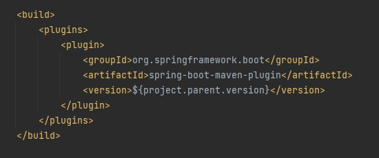
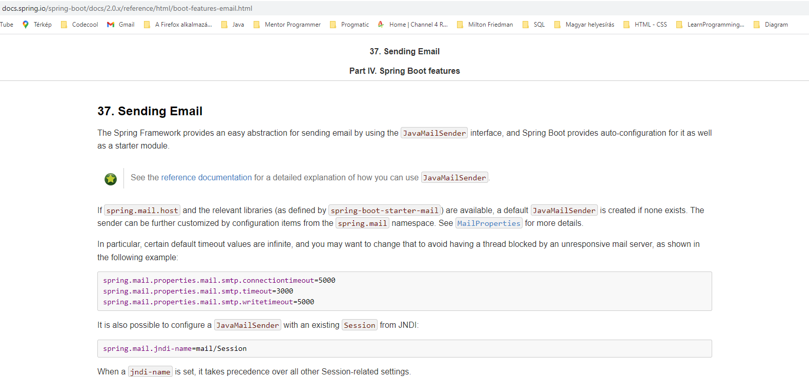
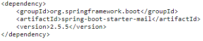
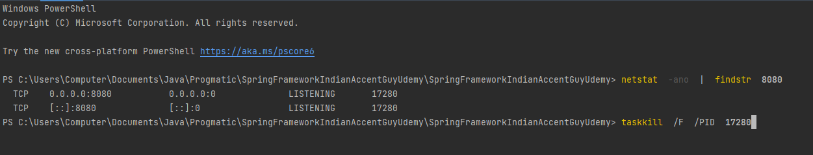
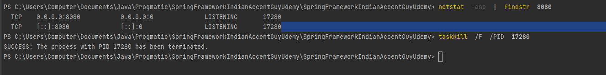

= Good to know!

Do not forget mvn install in terminal!

The problem I had in pom.xml:

https://stackoverflow.com/questions/64639836/plugin-org-springframework-bootspring-boot-maven-plugin-not-found

This one fixed the problem, version was missing:

Under src there are resources folder, and there you can find application.properties

In this one you can set the properties like localhost, domain, password, etc. and check under HelloController how to get the values!

'''
SpringProfile

There are 3 environments:

1. development
2. production
3. test

'''
There are 5 profiles:

- book
- grocery
- dev
- test
- prod

So we would like to use SMTP mail sender in production environment, and the MOCK mail sender in development!

So for this reason add @Profile("dev") to mock mail sender! And this means you can use this one in development environment!

You may find in txt file the required codes and fields for sending email!

Do not forget maven dependency:

https://mvnrepository.com/artifact/org.springframework.boot/spring-boot-starter-mail

For more details check this website:

https://docs.spring.io/spring-boot/docs/2.0.x/reference/html/boot-features-email.html

do not forget pom.xml!!! from maven dependencies!

Let's continue in a separate project! ...

if webserver 8080 is failed in terminál:

netstat  -ano  |  findstr  8080

then the number replace to the end:

taskkill  /F  /PID  17280

it was this terminal in IntelliJ:

Then it shows and you can use localhost again:

